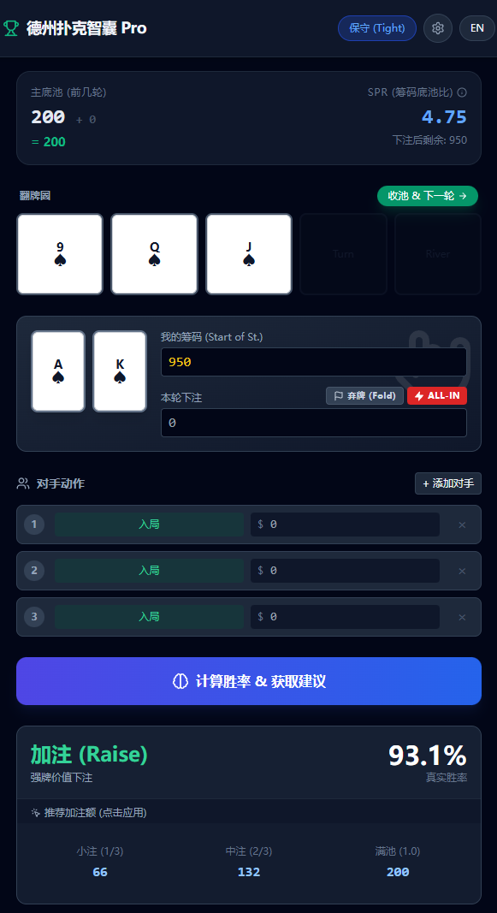
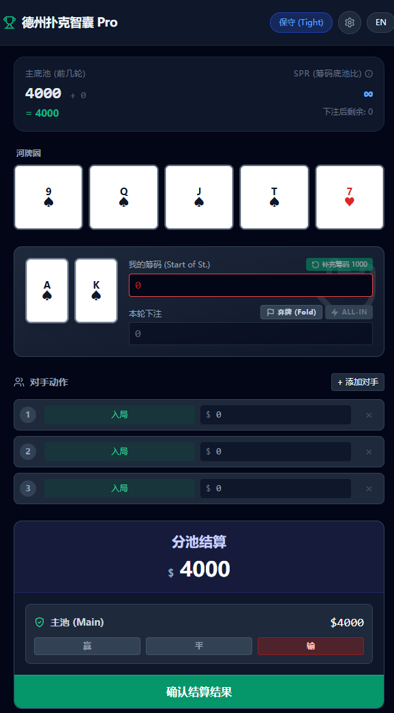

[Poker Advisor Pro (德州扑克智囊 Pro)

> **Live Demo:** [https://pokeradvice.netlify.app/](https://pokeradvice.netlify.app/)

## 📖 Introduction (项目介绍)

Poker Advisor Pro is a sophisticated, web-based decision support system for Texas Hold'em. It acts as a real-time HUD (Heads-Up Display) simulation, designed to help players make mathematically sound decisions through equity calculation, pot tracking, and strategic advice.

This project has evolved from a simple calculator into a full-fledged Game State Engine, capable of tracking the entire lifecycle of a hand—from Pre-flop to River—while handling complex scenarios like multi-way All-ins, Side Pots, and bankroll management.

Poker Advisor Pro 是一个先进的德州扑克网页版决策支持系统。它作为一个实时的 HUD（抬头显示）模拟器，通过胜率计算、底池追踪和策略建议，帮助玩家做出符合数学逻辑的最佳决策。

本项目已从一个简单的计算器演变为一个完整的 游戏状态引擎，能够追踪一手牌从翻牌前（Pre-flop）到河牌圈（River）的全生命周期，并能处理多人 All-in、边池（Side Pots）和资金管理等复杂场景。

## 🚀 Key Features (核心功能)

🧠 v3.5 Core Engine & Interaction (最新特性)

Separated Architecture (分离式架构):

EN: Migrated from a monolithic HTML file to a modular Separated Mode (HTML + JSX) for better maintainability and developer experience.

CN: 从单文件 HTML 迁移到了模块化的 分离模式 (HTML + JSX)，极大地提升了代码的可维护性和开发体验。

Global Hybrid Loading (全局混合加载):

EN: Implemented a robust loading strategy using Global React/ReactDOM builds to resolve CORS and module resolution issues in local environments without a build step.

CN: 实施了基于全局 React/ReactDOM 的混合加载策略，在无需构建步骤的情况下，完美解决了本地环境下的跨域（CORS）和模块解析问题。

## ⚡ One-Click Actions (一键操作):

Smart Bet (智能下注): Click on any strategy suggestion (e.g., "Small Bet") to auto-fill the amount. (点击任意策略建议即可自动填入下注金额)

🏳️ Instant Fold (一键弃牌): New "Fold" button instantly deducts the current bet attempt, resets the pot, and deals a fresh hand—optimizing the flow for high-volume sessions. (新增“弃牌”按钮，点击即扣除当前下注、重置底池并开始新的一局，专为高频练习设计)

UX Polish (体验优化): Fixed "sticky zero" input behaviors for a smoother mobile typing experience. (修复了输入框“粘性0”的问题，移动端输入更加流畅)

## 💰 Pot & Bankroll Management (资金管理)

Smart Pot Logic: Automatically tracks Main Pot and Side Pots when multiple players are All-in with different stack sizes. (智能边池逻辑：自动处理多人 All-in 时的 主池 与 边池 分配)

SPR Tracking: Real-time Stack-to-Pot Ratio calculation with "Pot Committed" warnings when SPR < 1. (实时计算 SPR (筹码底池比)，并在 SPR < 1 时发出“套池”警告)

Dynamic Rebuy: Bankruptcy protection with customizable buy-in amounts. (动态重买机制：提供破产保护和自定义买入额)

## 🤖 Strategy Advisor (策略建议)

Real-time Equity: Uses Monte Carlo simulations (1500+ iterations/run) to predict win rates. (实时胜率：使用 蒙特卡洛模拟 算法进行高精度预测)

Persona-based Advice (风格化建议): Switch between three distinct strategy engines:

🛡️ Conservative (Tight): Solid, value-heavy playstyle. (保守/紧凶)

⚔️ Aggressive: Balanced semi-bluffs and pressure. (激进)

🔥 Maniac (Bluff): High variance, exploits fold equity. (疯鱼/诈唬)

## 🛠 Tech Stack (技术栈)

This project utilizes a modern Zero-Build Architecture, allowing it to run directly in the browser without a complex Node.js build step (Webpack/Vite), making it incredibly lightweight and easy to deploy.

本项目采用现代化的 零构建架构 (Zero-Build Architecture)，无需复杂的 Node.js 构建步骤（如 Webpack/Vite）即可直接在浏览器中运行，极其轻量且易于部署。

Frontend: React 18 (via CDN & Global UMD)

Styling: Tailwind CSS (via CDN)

Icons: Lucide React

Compiler: Babel Standalone (In-browser JSX compilation)

Deployment: Netlify (CI/CD via GitHub)

## 📂 Installation & Usage (安装与使用)

Local Development (本地开发 - 推荐)

Due to browser CORS policies regarding local file access (file://), you need a local server to load the separated .jsx module.
由于浏览器的跨域策略限制了对本地文件（file://）的访问，你需要一个本地服务器来加载分离的 .jsx 模块。

Clone the repository (克隆仓库):

git clone [https://github.com/WilliamLiu5318851/poker-advisor-pro.git](https://github.com/WilliamLiu5318851/poker-advisor-pro.git)

Run with Live Server (使用 Live Server 运行):

Open the folder in VS Code. (用 VS Code 打开文件夹)

Install the "Live Server" extension. (安装 "Live Server" 插件)

Right-click index.html and select "Open with Live Server". (右键点击 index.html 并选择 "Open with Live Server")

Alternative (Python 替代方案):

# In the project directory (在项目目录下)
python -m http.server
# Open http://localhost:8000

Deployment (部署)

Simply push your changes to GitHub. Netlify (connected to your repo) will automatically deploy the index.html and PokerAdvisorPro.jsx files.
只需将更改推送到 GitHub。连接到你仓库的 Netlify 会自动部署最新版本。

## 📸 Screenshots (截图)

| Equity Calculation (胜率计算) | Strategy Advice (策略建议) |

|  |  |

👤 Author (作者)

William Liu (z5318851)

University: University of New South Wales (UNSW)

Major: Computer Science Undergraduate

Expected Graduation: Sep 2026

Disclaimer: This tool is for educational and simulation purposes only. (免责声明：本工具仅用于教育和模拟目的。)](https://gemini.google.com/share/4cf188c0901e)
